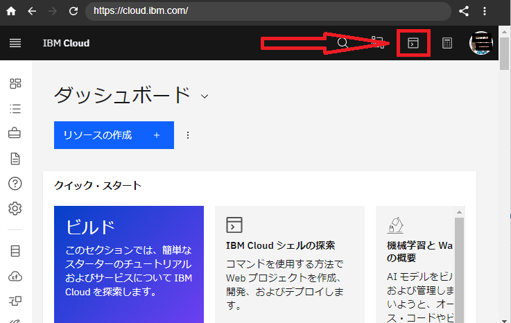
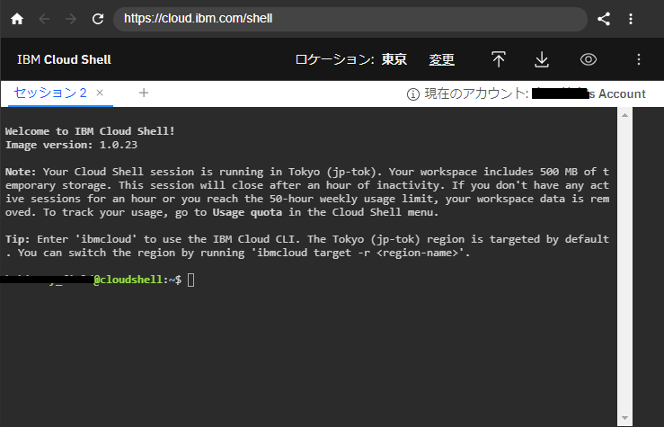

# IBM Cloud Shell 
IBM Cloud にログインすると無料で [IBM Cloud Shell](https://www.ibm.com/cloud/cloud-shell) という環境が利用できます。

IBM Cloud Shell には [IBM Cloud CLI](https://www.ibm.com/jp-ja/cloud/cli) がセットアップされているので、わざわざローカル環境などに CLI を準備することなく、ワンクリックで CLI での作業を始めることができます。 

`git` や `node` などのツールもインストールされているので、「リポジトリをクローン」して「動作確認」して「IBM Cloud にデプロイ」も迅速に行うことができます。

いくつかの制限もあります。

- しばらく放っておくとセッションが切断される。
- ロカールディスク 500 MB (テンポラリなのでしばらくすると削除される) 
- 一週間に 50 時間まで利用可能

公式ドキュメント
[[Cloud Shell での作業](https://cloud.ibm.com/docs/cloud-shell?topic=cloud-shell-shell-ui)]
[[Cloud Shell ファイルの処理](https://cloud.ibm.com/docs/cloud-shell?topic=cloud-shell-files)]
[[Cloud Shell インストール済みのプラグインとツール](https://cloud.ibm.com/docs/cloud-shell?topic=cloud-shell-plugins-tools)]

**無料です！！** (2021/06/18 現在)

## 使い方
ブラウザでIBM Cloud にログイン後、画面右上の `IBM Cloud シェル` アイコンをクリックします。



すると、別タブなどで `IBM Cloud Shwll` が開きます。


# IBM Cloud CLI


https://cloud.ibm.com/docs/cli?topic=cli-ibmcloud_cli


## 設定・準備 (Cloud Foundry / Functions など…)

IBM Cloud のセッションを開くと、すでに CLI でログインした状態になっています。

`IBM Cloud Foundry` や `IBM Cloud Functions` を利用する場合は、**リソースグループ**と**組織**、**スペース**を指定しておく必要があります。


## 現在の設定確認

コマンド

> ibmcloud target

結果

```
API endpoint:      https://cloud.ibm.com   
Region:            jp-tok   
User:              ----------@gmail.com   
Account:           kakimoty's Account (****************f6d1dfad**********)   
Resource group:    No resource group targeted, use 'ibmcloud target -g RESOURCE_GROUP'   
CF API endpoint:      
Org:                  
Space:   
```

**Resource group(リソースグループ)**、**Org(組織)**、**Space(スペース)** が設定されていないので、1つずつ設定していきます。


## リージョン変更
ログイン先のリージョンが、作業したいリージョンではない場合、リージョンを切り替える必要があります。

### リージョン一覧確認

コマンド

> ibmcloud regions

結果

```
Listing regions...

Name       Display name   
au-syd     Sydney   
in-che     Chennai   
jp-osa     Osaka   
jp-tok     Tokyo   
kr-seo     Seoul   
eu-de      Frankfurt   
eu-gb      London   
ca-tor     Toronto   
us-south   Dallas   
us-east    Washington DC   
br-sao     Sao Paulo   
```

### リージョン設定

コマンド

> ibmcloud target -r [リージョン Name]

## リソースグループ設定

### リソースグループ一覧確認

コマンド

> ibmcloud resource groups

```
Retrieving all resource groups under account ****************f6d1dfad********** as ----------@gmail.com  ...
OK
Name      ID                                 Default Group   State   
Default   68*****e747**********6aa5*****bf   true            ACTIVE   
```

### リソースグループ設定

コマンド

> ibmcloud target -g [リソースグループName]

結果

```
API endpoint:      https://cloud.ibm.com   
Region:            jp-tok   
User:              ----------@gmail.com   
Account:           kakimoty's Account (****************f6d1dfad**********)   
Resource group:    Default     ← ★★設定されたことを確認できます★★
CF API endpoint:      
Org:                  
Space:   
```

## 組織設定(Org)
### 組織一覧確認

コマンド

> ibmcloud account orgs

結果

```
Getting orgs in region 'us-south' as ----------@@gmail.com...
Retrieving current account...
OK

Name             Region     Account owner        Account ID                         Status   
Test-Org-name1   us-south   ----------@---.com   aa7b2f33c41c28f6d1dfadc308727245   active  
```

### 組織設定

コマンド

> ibmcloud target -o [組織 Name]

結果

```
API endpoint:      https://cloud.ibm.com   
Region:            jp-tok   
User:              ----------@gmail.com   
Account:           kakimoty's Account (****************f6d1dfad**********)   
Resource group:    Default     
CF API endpoint:   https://api.us-south.cf.cloud.ibm.com (API version: 2.164.0)  
Org:               Kakimoty-Field    ← ★★設定されたことを確認できます★★
Space:   
```
## スペース設定(Space)
### スペース一覧確認

コマンド

> ibmcloud account spaces

結果

```
Getting spaces under organization kakimoty in region us-south as ----------@gmail.com...
OK

Name   
dev   
```

### スペース設定

コマンド

> ibmcloud target -s [スペース Name]

結果

```
API endpoint:      https://cloud.ibm.com   
Region:            jp-tok   
User:              ----------@gmail.com   
Account:           kakimoty's Account (****************f6d1dfad**********)   
Resource group:    Default     
CF API endpoint:   https://api.us-south.cf.cloud.ibm.com (API version: 2.164.0)  
Org:               Kakimoty-Field    
Space:             dev       ← ★★設定されたことを確認できます★★
```
